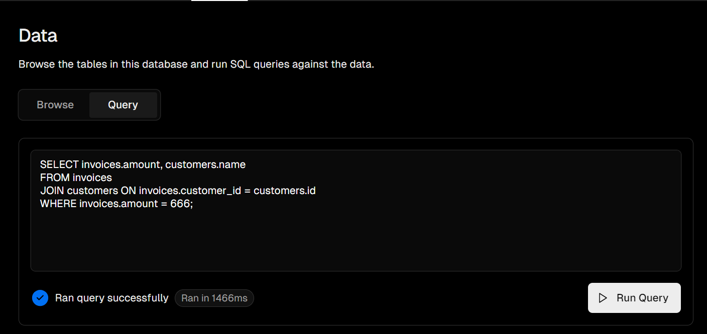
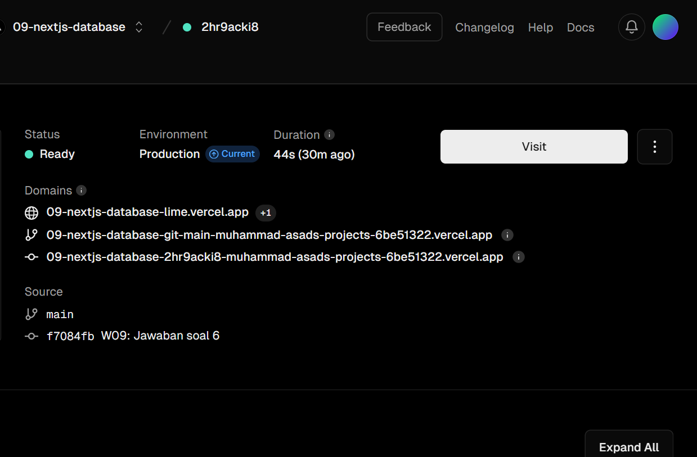
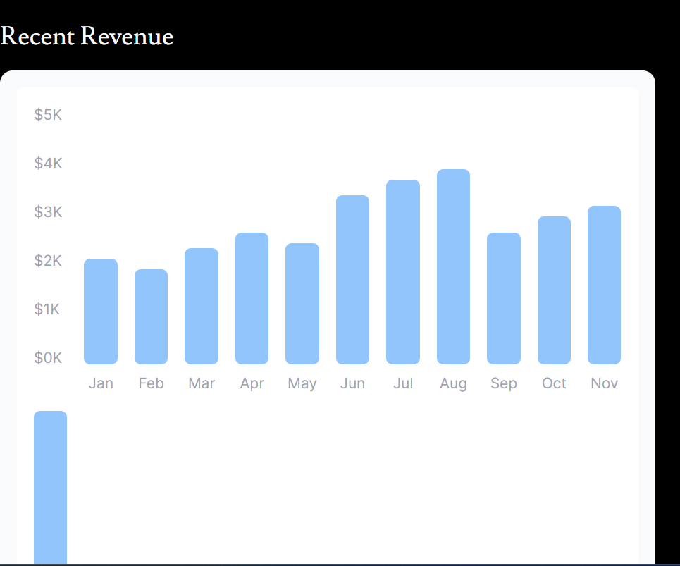
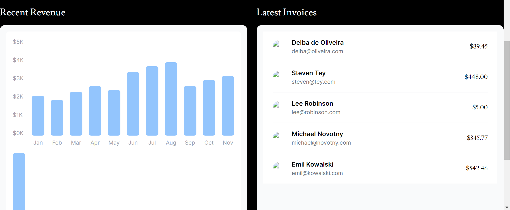
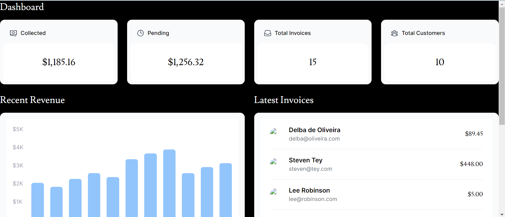

## Laporan Praktikum

|  | Pemrograman Berbasis Framework 2024 |
|--|--|
| NIM |  2141720269|
| Nama |  Muhammad Asad |
| Kelas | TI - 3I |

## Question 1
Capture the results of deploying your project and create a report in the README.md file . Explain what you have learned?
## ANswer
By these steps i undestand that Vercel is a cloud platform for static sites and serverless functions, designed to make it easy to deploy websites and applications. It provides a seamless experience for us to deploy, manage, and scale our projects with minimal configuration.

## Question 2
Capture the results of deploying your project and create a report in the README.md file . Explain what you have learned?
## ANswer
In this practicum, we have learned about how to make a database on Vercel and connect it to our workspace. We could achieve this by using .env.local code snippet and paste it to our project directory.

## Question 3
Capture the results of deploying your project and create a report in the README.md file . Explain what you have learned?
## ANswer
In this practicum, we have learned about seeding the data into the configured database. During the seeding process, there are some errors encountered such as missing dotenv, bcrypt, and data.js modules. However, this could be resolved by installing the necessary modules and changing the directory of the data.js file in the seed.js file.

## Question 4
Capture queryyour results and create a report in the README.md file . Explain what you have learned? Try executing another SQL query according to your creation, capture the results and explain them!
## ANswer
In this practicum, we learned to query on the database on vercel. We also create a query of our own.

## Question 5
Do a push, then pay attention to your Vercel project dashboard account. Capture and attach a link to your application that has been successfully deployed, then create a report in the README.md file . Explain what you have learned?
## ANswer
In this practicum, we have learned that vercel provide a server that we can use for our app, now we don't need for local server anymore.

## Question 6
Capture and push the results, then create a report in the README.md file . Explain what you have learned?
## ANswer
In this practicum, we have visualized the data into the form of bar chart. The chart is still not graphically pleasing, however it already served the purpose of data visualization.

## Question 7
Capture and push the results, then create a report in the README.md file . Explain what you have learned?
## ANswer
In this practicum, we have visualized the data into the form of bar chart. The chart is still not graphically pleasing, however it already served the purpose of data visualization.

## Practical Question1
If you look at the file src\app\page.tsxfor the component, Cardit has actually been created as a molecule in the file src\app\components\molecules\card.tsx, namely component CardWrapper. Please adjust it so that it looks like the following image.

## Output

## Practical Question2
Pay attention to the function fetchCardData()(in the file src\model\query.tsx) from question number 1. Explain the meaning of the code and query carried out in the function!
## ANswer
The fetchCardData() is used to fetch data that are used in the cards displayed above the current revenue. In that code, there are multiple declarations that specifies the SQL query that is going to be executed. For example, the invoiceCountPromise is used to execute SELECT COUNT(*) FROM invoices, which will count all invoice data. The same also goes to customerCountPromise. The invoiceStatusPromise describes the sum of invoices that are paid and pending.
After executing these commands, the program will then returns the data to the system and displays it in the card molecule.