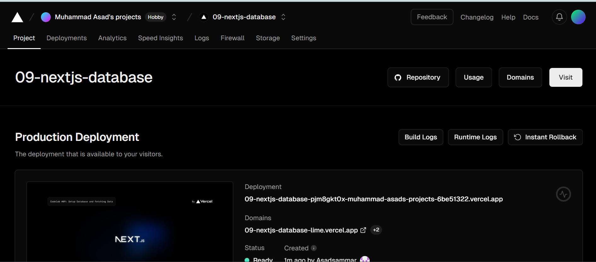
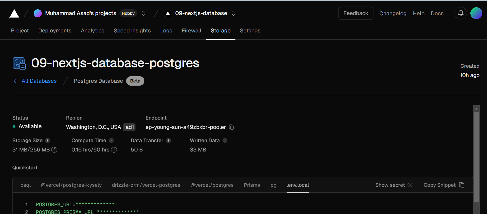
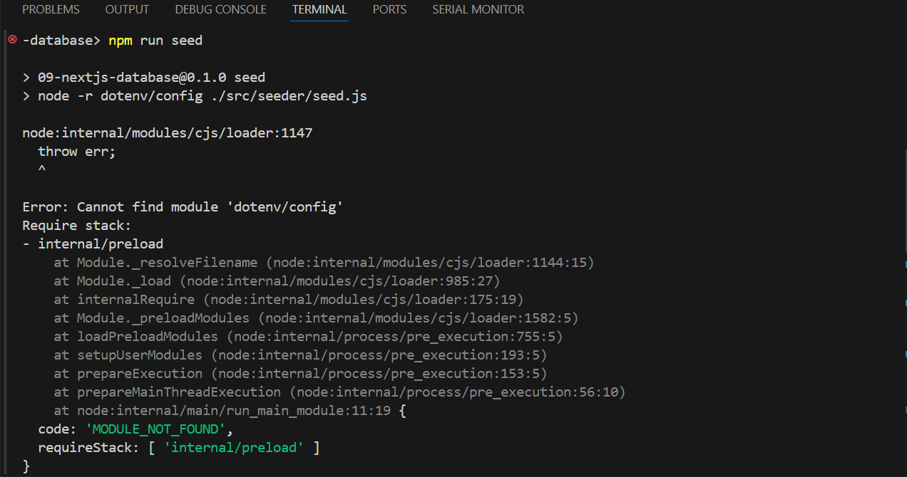

## Laporan Praktikum

|  | Pemrograman Berbasis Framework 2024 |
|--|--|
| NIM |  2141720269|
| Nama |  Muhammad Asad |
| Kelas | TI - 3I |

## Question 1,2
What is the difference between the Form_2first function and the second?
Why do you need to delete state fullName? What are the advantages?
## ANswer
Form is a game-related form, while Form2 deals with capturing and displaying user names. Deleting the fullName state in Form2 streamlines the component and improves efficiency.