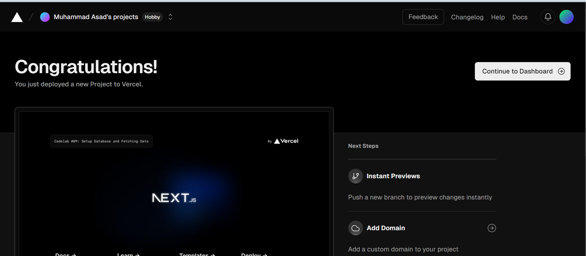

## Laporan Praktikum

|  | Pemrograman Berbasis Framework 2024 |
|--|--|
| NIM |  2141720269|
| Nama |  Muhammad Asad |
| Kelas | TI - 3I |

## Question 1
Capture the results of deploying your project and create a report in the README.md file . Explain what you have learned?
## ANswer
By these steps i undestand that Vercel is a cloud platform for static sites and serverless functions, designed to make it easy to deploy websites and applications. It provides a seamless experience for us to deploy, manage, and scale our projects with minimal configuration.

## Question 2
Capture the results of deploying your project and create a report in the README.md file . Explain what you have learned?
## ANswer
In this practicum, we have learned about how to make a database on Vercel and connect it to our workspace. We could achieve this by using .env.local code snippet and paste it to our project directory.

## Question 3
Capture the results of deploying your project and create a report in the README.md file . Explain what you have learned?
## ANswer
In this practicum, we have learned about seeding the data into the configured database. During the seeding process, there are some errors encountered such as missing dotenv, bcrypt, and data.js modules. However, this could be resolved by installing the necessary modules and changing the directory of the data.js file in the seed.js file.